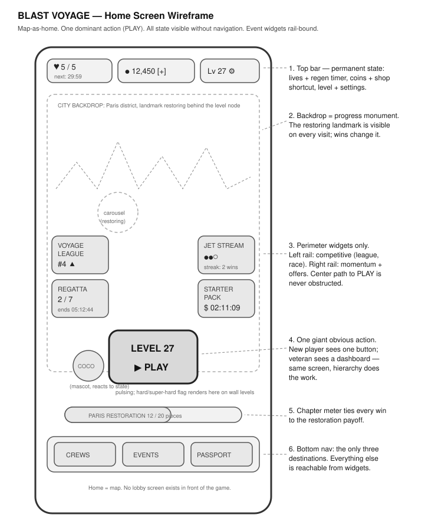
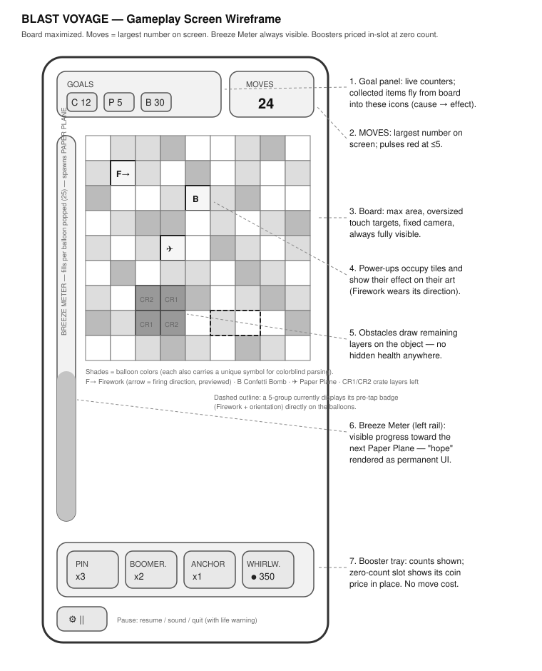

# BLAST VOYAGE

## Original Game Concept — Casual Tap-to-Blast Puzzle Game

**Case Study Part 2 — Product Specialist Position, Dream Games**

**Prepared by:** [Candidate Name]
**Date:** July 2026

---

## Table of Contents

1. Brief Introduction of the Game Concept
2. Core Rules & Player Commands (foundation for everything below)
3. Gameplay Mechanics for the First 50 Levels (Obstacles, Power-Ups, Boosters — with a full level-by-level plan)
4. Concept Ideas — Basic Match Elements, Power-Ups, Boosters, Obstacles
5. Meta-Game Design
6. Level Design Strategy
7. UI Design — Home Screen & Gameplay Screen (Wireframes)
8. Why This Game Wins Globally — Closing Argument

---

# 1. Brief Introduction of the Game Concept

**Blast Voyage is a level-based, tap-to-blast casual puzzle game about a joyful journey around the world.** The player pops groups of two or more adjacent same-colored balloons to clear thousands of hand-crafted puzzle levels, and every level flown wins carries **Coco** — a warm-hearted red panda balloon pilot — one stop further on a world tour, restoring beloved public places in the world's most iconic cities: a carousel in Paris, a cherry-blossom park in Tokyo, a tea garden in Istanbul, a beach promenade in Rio. The core promise to the player: *five seconds from app open to first pop, a fair puzzle every level, and a beautiful world that grows because you played.*

**One-line pitch:** *Toon Blast's instant tap satisfaction × Royal Match's frictionless meta and live-ops discipline × a travel theme with universal, borderless appeal.*

**The core loop:** spend a life → enter the next level → pop balloon groups to clear the level goals within a move limit → earn coins and event progress → watch the current city district restore itself one landmark piece at a time → repeat. Five lives, one regenerating every 30 minutes. **No forced ads, IAP-only monetization** driven by honestly-flagged difficulty — the Dream Games model, because it is the model that builds decade-long trust.

**Design pillars** (every decision in this document traces to one of these):

1. **One verb, zero friction.** Tapping a visible group is the lowest-friction input in the genre. Nothing in Blast Voyage — no meta choice, no gate, no second currency — ever stands between the player and the next tap.
2. **Skill you can see.** Power-up creation is fully deterministic and *previewed on the board before the tap* (§2.4). Good players get better in ways they can feel; casual players never need to notice.
3. **Hope is a mechanic.** The signature **Paper Plane** system (§2.5) guarantees that even a struggling board keeps producing goal-seeking help, converting near-losses into near-wins — protecting session mood *and* continue-purchase intent.
4. **A world worth restoring.** The travel meta gives progress a face (Coco), a place (the current city), and a payoff (the restored landmark) — without a single decoration decision or story gate slowing the ladder down.

**Target audience:** the broad global casual puzzle audience, 25–55, all genders, session length 3–8 minutes. The travel theme is deliberately **borderless**: unlike themes anchored in one culture's fiction, "the world's beautiful places" is aspirational everywhere, localizes perfectly (your own country's chapter becomes a marketing beat), and supports endless content (there is always another city) and endless seasonal live-ops (every culture's festivals become event themes: Hanami, Carnival, Diwali, Oktoberfest).

**Why balloons as the match element:** popping a balloon is the single most universally satisfying tactile fantasy that maps onto "tap to blast" — the theme *explains the verb*. And balloons connect the board to the meta: Coco travels by balloon; the thing you pop is the thing that carries you.

---

# 2. Core Rules & Player Commands

*(Defined once here so the 50-level plan in §3 and the concept catalog in §4 can build on it without forward references.)*

## 2.1 The Board and the View

Portrait orientation, one-handed play. A fixed, fully visible board (typically 9×9, shape varies per level) of colored **balloons**, framed top by the **goal panel and moves counter**, bottom by the **booster tray**, and on the left edge by the **Breeze Meter** (§2.5). No avatar, no camera movement, no scrolling: the player acts directly on the board.

## 2.2 Commands — the Complete Input List

| # | Command | Input | Effect | Costs a Move? |
|---|---|---|---|---|
| 1 | **Blast** | Tap any group of **2+ adjacent same-colored balloons** (orthogonal adjacency) | The whole group pops; balloons above fall; new balloons drop in from the top | **Yes** |
| 2 | **Activate power-up** | Tap a power-up on the board | Fires it; if another power-up is orthogonally adjacent, they **merge automatically** into a combo (§2.6) | **Yes** |
| 3 | **Use item booster** | Tap a tray booster (arms it), then tap a target tile | Applies the item's effect (§4.3) | **No** |
| 4 | **Pause** | Tap the settings button | Pause overlay (resume / sound / quit-with-warning) | — |

**Edge cases, spelled out** (nothing left for the implementer to assume):

- **Tapping a lone balloon** (no same-colored orthogonal neighbor): wiggle animation + soft sound, **no move consumed**. Mistaps are always free.
- **Balloons cannot be moved by the player** — only popped. All board manipulation happens through what you choose to pop and what gravity does next.
- **Falling balloons do not auto-pop.** New groups formed by gravity simply become tappable — the player harvests every cascade by hand, keeping 100% of agency in the player's finger (the correct choice for a blast game; luck-cascades belong to swap games).
- **Dead board** (no group of 2+ anywhere): automatic free shuffle with a brief notice. The player is never softlocked and never charged for board state they did not create.
- **Input during resolution:** taps during gravity are buffered for a beat, never silently dropped.

## 2.3 Power-Up Creation — Deterministic and Previewed

Popping a large enough group **creates a power-up on the exact tile the player tapped** (placement is a player skill, not luck). Thresholds:

| Group Size at Tap | Creates | Preview on Board |
|---|---|---|
| **5–6** | **Firework** (row/column rocket) | Group displays a small firework badge **including its orientation** |
| **7–8** | **Confetti Bomb** (radius-2 blast) | Bomb badge on the group |
| **9+** | **Globe** (clears every balloon of that group's color) | Globe badge on the group |

**Novel rule #1 — shape decides the Firework's direction (per Note 4, deliberately different from existing games):** the Firework's orientation is **not random**. If the popped group's bounding box is wider than tall → horizontal Firework; taller than wide → vertical; on a tie → it points toward the side of the board containing more remaining goal tiles. Because the badge previews the orientation *before* the tap, aiming a Firework by *sculpting the shape of a group* becomes Blast Voyage's signature skill — visible to experts, invisible to casuals (who still get a rocket either way).

## 2.4 The Skill Economy of Group Growing

The pre-tap badge system makes every board a visible market: pop a 4-group now, or spend taps elsewhere so gravity grows it to 5 and mints a Firework? At 7? At 9? Because the badge, the placement rule, and the orientation rule are all deterministic, high-level play is *manufacturing the right power-up, pointed the right way, on the right tile* — a genuine skill ceiling built from a single verb.

## 2.5 Novel Rule #2 — The Breeze Meter and the Paper Plane

Every level has a **Breeze Meter** on the left edge of the board. **Every balloon popped adds one point** to the meter (power-up clears count too). When it fills (baseline 25 balloons; tunable per level), a **Paper Plane** spawns on the tile of the pop that filled it, and the meter resets.

**The Paper Plane**, when tapped, flies to the **nearest remaining goal item**, pops it, and clears the tile it lands on. It is the game's guaranteed frustration valve — the answer to blast-genre's classic dead end, *"I can see the last crate but no group can reach it."* Design properties, spelled out:

- The meter charges from the one thing the player is always doing (popping), so help flows *faster* exactly when the player is grinding a stubborn board.
- Spawning at the filling tap's location keeps placement in player hands; timing the fill is another quiet skill layer.
- The Plane is deliberately modest alone (one goal tile) but is a **delivery vehicle in combos** (§2.6) — experts save it to carry a Bomb into a fortress.
- Meter fill requirement is a first-class difficulty dial (§6.2): generous on recovery levels, tight on Super Hard walls.

*(Reference point for the review team: this deliberately fuses the reliability of Royal Match's Propeller with a charge economy the player can pace — but its creation rule, placement rule, and combo behavior are original to this design, per Note 4.)*

## 2.6 Power-Up Combinations (adjacency + one tap)

Tapping a power-up orthogonally adjacent to another merges them automatically:

| Combination | Result |
|---|---|
| Firework + Firework | Cross blast — full row **and** full column |
| Firework + Confetti Bomb | Giant cross — three rows and three columns wide |
| Confetti Bomb + Confetti Bomb | Radius-3 mega blast with screen shake |
| Globe + Firework | Every balloon of the Globe's color becomes a Firework; all fire (orientations auto-balanced rows/columns) |
| Globe + Confetti Bomb | Every balloon of that color becomes a Bomb; all detonate |
| Globe + Globe | **Clears the entire board** — the game's ultimate moment |
| Paper Plane + (Firework / Bomb / Globe) | The Plane **carries** its partner and detonates the partner's full effect on arrival at a goal — precision delivery of heavy ordnance |
| Paper Plane + Paper Plane | Three Planes launch at three separate goals |

The table is monotonic — any combo is at least as strong as its parts — so experimentation is always safe and always rewarded.

## 2.7 Winning, Losing, Continuing

- **Win:** all goal counters reach zero → level ends immediately → **remaining moves convert into random board power-ups that chain-detonate** for bonus coins (efficiency is directly rewarded; every win ends in fireworks — literally, on brand).
- **Lose:** moves reach zero with goals remaining → **Continue offer**: +5 moves for coins, keeping all board progress → declining ends the attempt and the life.
- **Lives:** 5 max, 30-minute regen, teammate gifting, timed unlimited-lives event rewards.

---

# 3. Gameplay Mechanics for the First 50 Levels

The first 50 levels are the game's most important product surface: they must convert an installer into a believer. The plan below follows a strict **introduce → isolate → combine** teaching cadence (one new thing at a time, in a level built around it, then mixed with known elements), a **pulsed difficulty curve** with honestly flagged walls, and a meta unlock schedule that adds one layer of meaning roughly every 10 levels.

## 3.1 What Exists by Level 50 — Summary

| Category | Introduced in the First 50 Levels | Level |
|---|---|---|
| **Core verb** | Tap-to-blast (2+ adjacent) | 1 |
| **Power-ups** | Firework (5+) | 4 |
| | Confetti Bomb (7+) | 7 |
| | Globe (9+) | 14 |
| | Combos (adjacency merge) | 17 |
| | Breeze Meter + Paper Plane | 20 |
| **Obstacles** | Luggage crates (1- and 2-layer) | 10 / 12 |
| | Bubbles (encased balloons) | 26 |
| | Souvenirs (gravity collectibles) | 32 |
| | Mailboxes (postcard spawners) | 38 |
| | Fog (spreading obstacle) | 46 |
| **Boosters (items)** | Pin (single tile) | 9 |
| | Boomerang (row) / Anchor (column) | 19 / 24 |
| | Whirlwind (shuffle) | 31 |
| | Pre-level loadout slots (Firework / Bomb / Globe at start) | 21 |
| **Difficulty tiers** | First **Hard** level | 25 |
| | First **Super Hard** level | 50 |
| **Meta beats** | Paris chapter (levels 1–25) → carousel restored; Tokyo chapter (26–50) → hanami park restored; Jet Stream streak (13), Voyage League (30), Travel Crews/teams (35) | — |

## 3.2 Level-by-Level Plan (Levels 1–50)

Colors = balloon colors in the spawn pool (the strongest difficulty dial in a blast game — more colors fragment groups). Target = first-attempt win-rate target used for tuning (§6.4).

| Lv | Colors | New / Focus | Goals & Board Intent | Target |
|---|---|---|---|---|
| 1 | 3 | **Tutorial: tap-to-blast** | Pop 20 red balloons; giant pre-seeded groups; hand cursor shows first tap; unloseable | ~99% |
| 2 | 3 | Two simultaneous goals | 15 blue + 15 yellow; teaches reading the goal panel | ~97% |
| 3 | 4 | Fourth color; full 9×9 board | 40 balloons across three colors; first "real" board | ~95% |
| 4 | 4 | **Firework intro (5+ group)** | Guided level: board pre-seeded with two obvious 5-groups; goal "use 2 Fireworks"; badge preview explained | ~97% |
| 5 | 4 | Firework practice | Color goals sized so Fireworks are clearly the efficient path | ~92% |
| 6 | 4 | **Orientation teaching** | Tall narrow board where only *vertical* Fireworks help; tutorial explains shape→direction rule | ~90% |
| 7 | 4 | **Confetti Bomb intro (7+)** | Pre-seeded 7-cluster; goal "use 2 Bombs"; radius shown with a ring preview on first use | ~95% |
| 8 | 4 | Bomb practice | Dense center goals rewarding radius damage | ~90% |
| 9 | 4 | **Pin booster granted** (×3 free) | Board with a deliberate lone straggler goal; tutorial: tray items cost no move | ~92% |
| 10 | 4 | **Luggage crates intro** (1-layer) | 12 crates in open field; teaches "blasts adjacent to obstacles damage them"; **Paris area beat 1 restores after win** | ~92% |
| 11 | 4 | Crates on edges | Crates ring the border where groups are geometrically harder — first spatial lesson | ~85% |
| 12 | 4 | **2-layer crates** | Visible damage states (cracked after first hit); fewer crates, deeper | ~85% |
| 13 | 4 | **Jet Stream unlocks** (win-streak meter, §5.4) | Comfortable crate mix so the first streak starts warm | ~90% |
| 14 | 4 | **Globe intro (9+ group)** | Big open board, generous single color; goal "use 1 Globe"; the wow moment is engineered to happen | ~95% |
| 15 | 4 | Globe practice | 60-blue goal; player discovers Globe = goal-color nuke | ~88% |
| 16 | 4 | Crates + Fireworks together | First real "combine known things" level | ~82% |
| 17 | 4 | **Combo tutorial** | Two Fireworks pre-seeded adjacent; guided merge; combo table begins unlocking in player's head | ~95% |
| 18 | 5 | **Fifth color debuts** | Same layout class as 16 but fragmented groups — player *feels* the color dial | ~80% |
| 19 | 5 | **Boomerang booster granted** (row-clear, ×3) | Wide crate rows built to showcase it | ~85% |
| 20 | 5 | **Breeze Meter + Paper Plane intro** | Two crates sealed in a corner pocket no group can reach; the filling meter and first Plane rescue them; the "this game is fair" moment | ~93% |
| 21 | 5 | **Pre-level loadout unlocks** | Level-start popup now offers arming Firework/Bomb/Globe at start (first one free) | ~85% |
| 22 | 5 | Planes + corner crates | Layout rewards timing the meter fill near the pocket | ~80% |
| 23 | 5 | Crates + 5 colors, tighter moves | First level most players need 2 attempts on | ~65% |
| 24 | 4 | **Anchor booster granted** (column-clear, ×3); breather | Confidence rebuild before the wall; 4 colors feels luxurious now | ~90% |
| 25 | 5 | **HARD #1** (red-flagged) | Chapter finale: double ring of 2-layer crates, tight moves; pre-level boosters + Jet Stream become *strategic*; **Paris carousel fully restored on win — biggest meta payoff yet** | ~30% |
| 26 | 4 | **Tokyo chapter begins; Bubbles intro** | Balloons encased in bubbles (one adjacent hit frees the balloon, which then becomes matchable); friendly dose | ~92% |
| 27 | 4 | Bubble rows | Teaches that freed balloons rejoin the color economy | ~87% |
| 28 | 4 | **Bubbles + crates** — first obstacle pairing | The two known obstacles interleaved | ~80% |
| 29 | 4 | Bubble cluster center | Bombs visibly optimal; combo practice | ~82% |
| 30 | 4 | **Voyage League unlocks** (weekly leaderboard, §5.5); breather | Open playground level so the first league win is easy | ~92% |
| 31 | 5 | **Whirlwind booster granted** (shuffle, ×3) | Fragmented 5-color board where a shuffle demonstrably rescues | ~80% |
| 32 | 4 | **Souvenirs intro** (gravity collectibles) | 3 snow-globe souvenirs fall to the bottom collector row when their columns clear; wide lanes | ~90% |
| 33 | 4 | Souvenir routing | 2 souvenirs, narrow lanes; teaches column control | ~82% |
| 34 | 5 | **HARD #2** | Souvenirs above 2-layer crates: dig *and* route; vertical Fireworks (shape-sculpting!) are the expert path | ~30% |
| 35 | 4 | **Travel Crews unlock** (teams, §5.6); breather | Lives-gifting tutorial; warm level | ~90% |
| 36 | 5 | Souvenirs + bubbles | Freed balloons feed the lanes | ~78% |
| 37 | 5 | Chokepoint board | Two chambers joined by a 2-wide channel; souvenir must transit; Planes shine | ~72% |
| 38 | 4 | **Mailbox intro** (spawner) | Each hit on a mailbox ejects a postcard collectible onto the board; goal counts postcards; teaches repeated attention to one region | ~88% |
| 39 | 5 | Two mailboxes on opposite edges | Split attention; Firework orientation play | ~78% |
| 40 | 5 | **HARD #3** | Mailboxes + bubbles; postcards spawn inside bubble fields | ~28% |
| 41 | 5 | Postcards + souvenirs | Two collectible streams sharing lanes | ~75% |
| 42 | 4 | Breather: combo playground | Low-stakes open board seeded to produce Globe+Firework moments | ~92% |
| 43 | 5 | Crates + bubbles + tight moves | Compound puzzle, no new elements | ~68% |
| 44 | 5 | Mailboxes center chokepoint | Board geometry as the antagonist | ~70% |
| 45 | 6 | **Sixth color debuts** (unflagged but spicy) | Big board so 6 colors reads as variety, not cruelty — calibrating the player for endgame color counts | ~72% |
| 46 | 4 | **Fog intro** (spreader) | If no fog tile is cleared in a turn, fog spreads to one adjacent tile; small dose, big board; the game's first *pressure* mechanic | ~85% |
| 47 | 5 | **HARD #4** | Fog + crates: triage under pressure | ~28% |
| 48 | 5 | Fog + souvenirs | Protect the lanes while containing spread | ~70% |
| 49 | 4 | Confidence builder | Generous Breeze Meter (15-balloon fill) rains Planes; sets up the finale emotionally | ~93% |
| 50 | 6 | **SUPER HARD #1** (dark-flagged) | Chapter finale: fog field + bubbled postcards + mailbox behind 2-layer crates; every system in one board; **Tokyo hanami park fully restored on win**, chapter-complete celebration, Osaka teased | ~12% |

## 3.3 Why the Plan Is Shaped This Way

- **Every element gets a solo level before it gets a partner.** No level in 1–50 asks a player to learn two things at once. This is the single most protective rule for early funnel retention.
- **Walls arrive only after the player is armed.** Hard #1 (25) lands after streak rewards (13) and loadout (21) exist — difficulty always intersects a *resource decision*, never a dead end.
- **Breathers directly follow walls** (24→25→26, 49→50): the emotional loop is cruise → tension → spike → triumph → recovery, and the recovery levels are also where meta unlocks land so good news stacks on relief.
- **Meta payoff is synchronized with difficulty payoff:** the two flagged chapter finales (25, 50) are the same levels that complete the landmark restorations — the hardest fight and the biggest reward are one memory.
- **Every event and social system unlocked by 35 consumes the same action — winning the next level.** The decision space never grows; only the meaning of a win does. (This is the Royal Match live-ops lesson, applied from day one.)

---

# 4. Concept Ideas — Basic Match Elements, Power-Ups, Boosters, Obstacles

*(Per Note 2: concepts are described precisely enough to brief an artist, with reference anchors from live games where useful. Only the UI wireframes in §7 are drawn.)*

## 4.1 Basic Match Elements — the Balloons

Round, glossy, softly-3D balloons with a visible knot at the base and a candy-like highlight — tactile, "poppable" at a glance. Six colors, tuned for maximum hue separation **and each carrying a unique printed symbol for colorblind accessibility and instant group parsing**:

| Color | Symbol Motif (travel-themed) | Personality |
|---|---|---|
| Red | Heart stamp | Warm, primary accent color of the brand |
| Blue | Compass rose | Cool anchor color |
| Yellow | Sun | Highest luminance; reads at any size |
| Green | Leaf | Mid-tone; never adjacent in hue to blue |
| Purple | Star | Rare/special-feeling; used in 5+ color pools |
| Orange | Paper plane stamp | Sixth color, endgame pools only |

Balloons squash on landing, bulge on popping, and bob idly with a one-pixel float loop so the board always feels lighter than air. *(Feel reference: the tactile softness of Royal Match cubes; silhouette-first readability discipline of Toon Blast.)*

## 4.2 Power-Ups (created in-board by play)

- **Firework** — a rolled paper rocket with a fuse, its nose *visibly pointing* in its firing direction (orientation is gameplay information, so it is worn on the art). Launch: fizzing fuse anticipation, then a screen-length trail of confetti sparks.
- **Confetti Bomb** — a round striped party popper; pulses gently. Detonation: radial confetti burst, shockwave ring, brief screen shake (shake is *reserved* for Bomb-and-above so big plays keep a physical signature).
- **Globe** — a slowly spinning glassy globe that refracts the board behind it; on activation it flares and fires light beams to every balloon of its color. The rarest single power-up and drawn like the prize it is.
- **Paper Plane** — a crisp white origami plane that idles with a hover bob. On tap it banks, loops once (0.4s of pure charm), then darts to its goal with a pencil-line trail. When carrying a combo partner, the partner is visibly strapped beneath it — the player *sees* the payload they're delivering.

## 4.3 Boosters (owned consumables — the player's inventory)

**Pre-level loadout** (armed on the level-start popup, up to 3): board-spawned **Firework**, **Confetti Bomb**, **Globe** at move one. Earned from Jet Stream streaks, chests, events; purchasable with coins.

**In-level tray** (bottom of gameplay screen; never cost a move):

| Booster | Effect | Concept |
|---|---|---|
| **Pin** | Pops any single tile | A jaunty map pin — the "surgical" tool for the last stubborn goal |
| **Boomerang** | Clears a chosen row | Thrown from off-screen left, sweeps the row, returns |
| **Anchor** | Clears a chosen column | Drops from the top through the column with a splash of rope |
| **Whirlwind** | Reshuffles all balloons (obstacles stay) | A tiny friendly tornado crosses the board rearranging everything |

Tray slots show owned counts; a zero-count slot shows its coin price in place — the purchase path is one tap and never a navigation trip.

## 4.4 Obstacles — Behavioral Grammar First

All obstacles obey two universal rules (learned once, true forever): **(1)** they are damaged only by adjacent blasts and power-up effects; **(2)** their remaining state is always drawn on the object (cracks, layers, counters) — no hidden health anywhere. The first-50 roster:

| Obstacle | Behavior Class | Concept & Reference Anchor |
|---|---|---|
| **Luggage Crates** | Multi-layer adjacent-clear | Vintage travel trunks plastered with destination stickers; each hit tears stickers and splinters a layer. *(Class reference: Toon Blast crates / Royal Match boxes)* |
| **Bubbles** | Shield/container | Soap bubbles encasing balloons; one adjacent hit pops the bubble, freeing the balloon into the color economy — obstacle clearance that *feeds* the player, a deliberately generous design |
| **Souvenirs** | Gravity collectible | Snow globes that ride gravity; collected at the bottom row. Introduces column/lane control. *(Class reference: Toon Blast ducks / Royal Match diamonds)* |
| **Mailboxes** | Spawner/carrier | Cheerful red post boxes; each hit ejects a stamped **postcard** collectible onto a nearby tile; goal counts postcards — forces repeated attention to one region |
| **Fog** | Spreader (pressure) | Soft grey cloud tiles; if no fog is cleared in a turn, it drifts onto one adjacent tile. The only obstacle that acts *back*, reserved for late-chapter drama. *(Class reference: Candy Crush chocolate, modernized with gentler pacing)* |

**Post-50 pipeline (concept backlog, one new behavior class per chapter):** *Customs Gates* (colored locks opened only by popping a group of the matching color adjacent), *Ticket Booths* (obstacles that consume an adjacent balloon each turn — a reverse-spawner), *Lanterns* (chain-linked pairs that must be cleared in the same turn — introduces simultaneity), *Cuckoo Clocks* (countdown obstacles that must be cleared within N moves of first exposure). Each is a new *rule*, not a re-skin — the grammar stays small while the puzzle space compounds.

---

# 5. Meta-Game Design

The meta thesis, learned from Dream Games' own playbook: **protect the loop; iterate the meaning around it.** Every meta system below consumes exactly one player action — winning the next level — and adds meaning to it. Nothing adds decisions, gates, or friction.

## 5.1 The World Tour — Spatial Progression

Levels group into **chapters of ~25, each a beloved district of an iconic world city** (Paris → Tokyo → Istanbul → Rio → New York → Cairo → Seoul → …). Each win restores one element of the district — the carousel turns, the lanterns light, the cherry trees bloom — **automatically, with zero decoration choices**, in short skippable vignettes starring Coco. The chapter finale (always the flagged wall level) completes the district in a full transformation scene and lifts off the balloon toward the next city.

Why this beats abstract area progression: the player's progress monument is *a place they recognize and may love*. Localization becomes marketing ("your city is in the game"), and the content roadmap is inexhaustible and globally inclusive by construction.

## 5.2 Coco — the Mascot Layer

Coco the red panda pilot is the game's face: expressive, silent (no localization burden in the acting), reacting to wins, losses, and streaks from the home screen and celebrating restorations. Design intent mirrors King Robert's role in Royal Match: a character the player is *for*, giving emotional address to what would otherwise be a number going up. Seasonal outfits per city/event double as live-ops dressing.

## 5.3 Economy

- **One currency: coins.** Earned from wins (base + leftover-move bonus), chests, events. Spent on continues (+5 moves), booster purchases, and lives refills. Single-currency discipline keeps every price legible and every reward meaningful.
- **Lives: 5 / 30-minute regen / crew gifting / timed unlimited-lives rewards.** The session pacing valve and the social glue, unchanged from the proven model because it is load-bearing.
- **Monetization: IAP only, difficulty-driven, no forced ads.** Spend moments are the continue at a near-miss, the loadout before a flagged wall, and the refill mid-binge. The tuning covenant (§6.4) exists to keep every near-miss feeling *earned by the level*, because trust is the asset that compounds.

## 5.4 Jet Stream (win-streak system) — unlocks level 13

Consecutive wins climb a three-stage meter granting escalating free pre-level power-ups (1 → 2 → 3 armed automatically). A loss resets it. The streak converts wins into momentum, makes the *next* level always worth one more life, and quietly raises continue-purchase intent on walls ("I'm not losing this streak to two crates"). *(Role model: Royal Match's Butler's Gift.)*

## 5.5 Live-Ops Calendar

A dense rotation in the Royal Match mold, all feeding on level wins:

- **Voyage League** (unlocks lv 30): weekly division-based leaderboard of levels won; promotion/demotion; the competitive spine.
- **Balloon Regatta:** recurring 3-day race — first to N wins along a route claims tiered chests.
- **Tailwind Rush:** timed event where each win pre-charges the next level's Breeze Meter — a streak event expressed *through the signature mechanic*.
- **Festival Days:** seasonal themed events aligned with real global festivals (Hanami, Carnival, Diwali, Lunar New Year) — the travel theme makes every culture's celebration an authentic event skin, a live-ops advantage most fictions can't match.
- **Passport Album:** season-long collection meta — event wins award stamped **passport stamps**; completed pages pay chests; a completed passport pays the season's grand reward and a cosmetic Coco outfit. *(Role model: Book of Treasure / sticker-album metas, tied into the travel fiction.)*

## 5.6 Travel Crews (teams) — unlocks level 35

Up to 50 players: lives gifting, chat, and the **Crew Cup** (weekly team-vs-team wins race with shared chest tiers). Deliberately lightweight — the crew is a reason to log in and a place to feel useful, not a second game.

## 5.7 Session Architecture (how it all composes)

A typical mid-game session: open app (Coco greets, streak meter glows) → one obvious Play button → win two levels (coins, league points, regatta progress, album stamp all tick from the same wins) → hit the flagged wall → spend the streak-earned loadout → near-miss → continue decision → triumph → district restoration vignette → out of lives → request from crew → close app with tomorrow's reason pre-loaded. Every system above appears in that sentence, and none of them required a decision beyond "play the next level."

---

# 6. Level Design Strategy

## 6.1 Principles

1. **Hand-crafted, single ladder.** Every level is authored, numbered, and shared by all players — no procedural boards. The map always focuses the next level; "what do I do now?" never exists.
2. **Introduce → isolate → combine.** Every new element gets a tutorial level, then solo-practice levels, then pairings — never two new things at once (as executed in §3.2).
3. **One new thing every ~15–20 levels, forever.** The obstacle backlog (§4.4) sustains novelty cadence deep into the ladder, because "something new is near" is a retention promise, not an onboarding trick.
4. **Fail-with-hope rule.** Losing boards should end *visibly close*: goal counters nearly done, a Plane half-charged. Authoring and tuning both serve this — near-miss losses drive both retries and fair-feeling continues.
5. **Boards obey their own physics.** No scripted rescues, no rubber-banding the spawn pool against the player. Randomness stays within declared bounds; trust is a feature.

## 6.2 The Difficulty Dials

Each independent, each tunable per level:

1. **Move budget** vs. goal counts — the master dial.
2. **Color count** (4 → 6): the blast genre's strongest lever; extra colors shatter group connectivity and starve power-up minting.
3. **Obstacle depth** (layers, shields, spawner counts).
4. **Board geometry** (chokepoints, pockets, notches — hostility through shape).
5. **Goal dispersion** (spread dilutes power-up value; clusters reward one big combo).
6. **Breeze Meter fill cost** (15 = generous rescue flow; 35 = walls where Planes must be *earned*).
7. **Group-size starvation** (layouts that make 7+ groups rare, throttling Bomb/Globe production).

## 6.3 Curve Shape

A pulse, not a slope: 3–6 comfortable levels → a flagged wall → a breather → repeat, with wall frequency rising slowly over hundreds of levels. Difficulty tiers are **announced honestly** — **Hard** (red flag) and **Super Hard** (dark purple flag) on the map node and the level-start popup — because announced walls convert frustration into consent and budgeting into strategy (the single most important tuning-culture lesson from Royal Match and Toon Blast).

## 6.4 Tuning Targets and Process (the Product Specialist's chapter)

- **First-attempt win-rate targets:** Normal 65–90% (position-dependent, per §3.2), Hard 25–35%, Super Hard 10–15%. **Attempts-to-pass targets:** Normal ≤2, Hard 3–6, Super Hard 7–12.
- **Instrumentation per level:** attempts distribution, win rate by attempt number, quit-without-retry rate, continue take-rate, booster usage rate, move-surplus on wins (a win with 12 moves left means the budget is wrong), and *loss proximity* (average % of goals done at failure — the fail-with-hope metric).
- **Red-flag thresholds:** any level with quit-without-retry above baseline or a D1-churn spike in its cohort goes to re-tuning within the weekly content cycle regardless of revenue — a level that monetizes today and churns tomorrow is net-negative.
- **Playtest funnel:** internal solver pass (bounds check: is the level winnable at target percentile play?) → designer play → fresh-player lab tests for the first-200 band → soft-launch cohort telemetry → global, with A/B slots reserved for move budgets and meter costs.
- **Weekly content cadence:** new levels ship weekly at the top of the ladder; the tuning team re-visits the trailing 200 levels on telemetry continuously. Levels are content *and* economy — they are operated, not just shipped.

---

# 7. UI Design — Home Screen & Gameplay Screen (Wireframes)

Two wireframes are provided as companion files, referenced below. Design rationale follows each.

## 7.1 Home Screen Wireframe



Text schematic of the same layout:

```
┌─────────────────────────────────────┐
│ [♥5 29:59]      [🪙 12,450 +]  [⚙] │  ← Top bar: lives+timer, coins+shop, settings
│                                     │
│  ┌────────┐            ┌─────────┐  │
│  │VOYAGE  │            │JET      │  │  ← Perimeter widgets:
│  │LEAGUE  │            │STREAM   │  │    left = competitive,
│  │ #4 ▲   │            │ ●●○     │  │    right = momentum/offers
│  └────────┘            └─────────┘  │
│  ┌────────┐   PARIS    ┌─────────┐  │
│  │REGATTA │  (city     │STARTER  │  │
│  │ 2/7 🎈 │  skyline,  │PACK  $  │  │
│  └────────┘  carousel  └─────────┘  │
│              rebuilding)            │
│                                     │
│           ╭───────────╮             │
│           │ LEVEL 27  │             │  ← The one giant obvious action,
│           │  ▶ PLAY   │             │    centered, pulsing
│           ╰───────────╯             │
│        (Coco waves beside it)       │
│                                     │
│ [ CREWS ]  [ EVENTS ]  [ PASSPORT ] │  ← Bottom nav
└─────────────────────────────────────┘
```

**Rationale:** the map *is* the home screen — no lobby in front of the game. One dominant Play button on the current level node; everything else is perimeter. Lives, coins, streak state, and event timers are permanently visible so the player never navigates to learn whether they can afford to play. A brand-new player sees one button; a veteran sees a dashboard; it is the same screen because hierarchy, not hiding, does the work. Event widgets are compact, animated, and strictly rail-bound — the center path from thumb to Play is never obstructed. The restoring landmark sits behind the node so every visit to the home screen is also a look at the progress monument.

## 7.2 Gameplay Screen Wireframe



Text schematic:

```
┌─────────────────────────────────────┐
│  GOALS: [📦12] [💌 5]     MOVES: 24 │  ← Goal panel + moves (largest number on screen)
│─────────────────────────────────────│
│ B │  ┌───────────────────────────┐  │
│ R │  │ ● ● ● ▲ ▲ ● ■ ■ ●         │  │
│ E │  │ ● ▲ [F]▲ ● ● ■ ● ●        │  │  ← Board 9×9:
│ E │  │ ▲ ▲ ● ● [B] ● ● ▲ ●       │  │    ●▲■ = balloon colors
│ Z │  │ ● ■ ■ ▲ ● ● ▲ ▲ ●         │  │    [F]irework [B]omb
│ E │  │ ■ ● ▲ ●(✈)● ■ ● ▲         │  │    (✈) = Paper Plane
│   │  │ ▲ ● ● ■ ▲ ▲ ● ● ■         │  │    ⬛ = crate obstacle
│ ▓ │  │ ● ▲ ⬛ ⬛ ● ● ▲ ■ ●        │  │
│ ▓ │  │ ■ ● ⬛ ⬛ ▲ ● ● ● ▲        │  │
│ ▓ │  └───────────────────────────┘  │
│ ▲ │   Breeze Meter (fills per pop)  │
│─────────────────────────────────────│
│  [📍3] [🪃2] [⚓1] [🌪 $]      [⚙] │  ← Booster tray (counts / price-in-slot) + pause
└─────────────────────────────────────┘
```

**Rationale:** the board takes maximum area with oversized, forgiving touch targets; the moves counter is the largest number on screen and pulses red at ≤5. Goal items visibly fly from board to counter on collection, so cause-and-effect never needs explaining. The Breeze Meter lives on the left rail — visible progress toward the next Paper Plane at all times, which is the "hope" pillar rendered as UI. The tray shows counts, or the coin price *in the slot* when a booster is at zero — the purchase path is one tap long and appears exactly at the moment of need. Nothing overlays the board except modal moments (continue / win / lose), which dim but never hide the level behind them.

---

# 8. Why This Game Wins Globally — Closing Argument

1. **The verb is the most accessible in the genre**, and both novel systems deepen it without touching it: shape-aimed Fireworks reward mastery invisibly; the Breeze Meter guarantees hope mechanically. Casual players feel generosity; expert players feel a ceiling. That pairing is what carries a puzzle game from level 50 to level 5,000.
2. **The theme is borderless by construction.** "The world's beautiful places, restored by you" excludes no market, flatters every market it enters, converts every real-world festival into authentic live-ops, and never runs out of chapters.
3. **The meta is Dream Games-disciplined:** one currency, one action, zero friction, honest difficulty, no ads — every system stacks meaning onto the next level instead of competing with it. It is a design that respects why Royal Match works, then adds its own signature (the Plane, the shape-aiming, the passport, the world) in the layers where innovation belongs.
4. **It is operable as a product**, not just playable as a game: §6.4 ships with tuning targets, red-flag thresholds, and a telemetry plan, because a Product Specialist's level design strategy has to survive contact with a live dashboard.

*Thank you for reviewing this concept. I would be glad to walk through any system in depth — particularly the Breeze Meter economy tuning and the first-50 win-rate curve — in person.*
