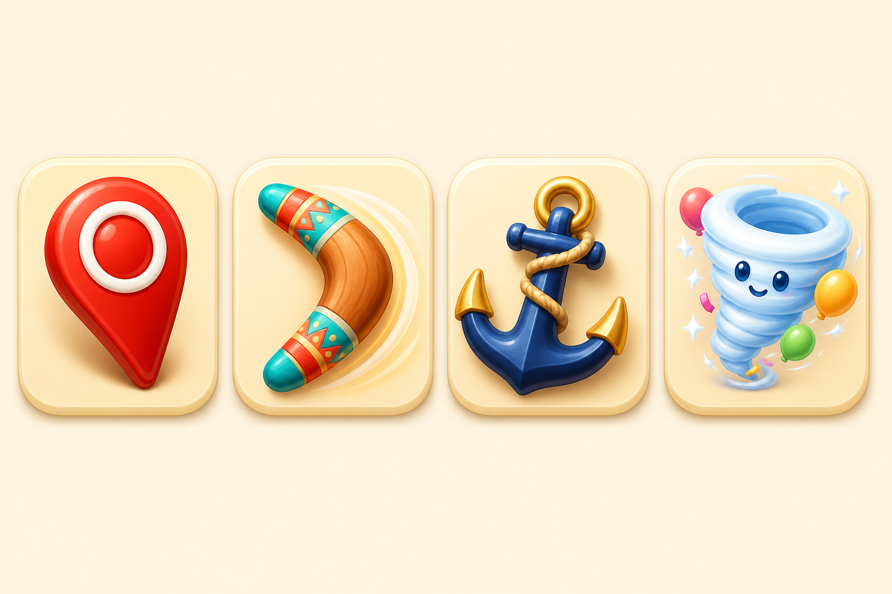
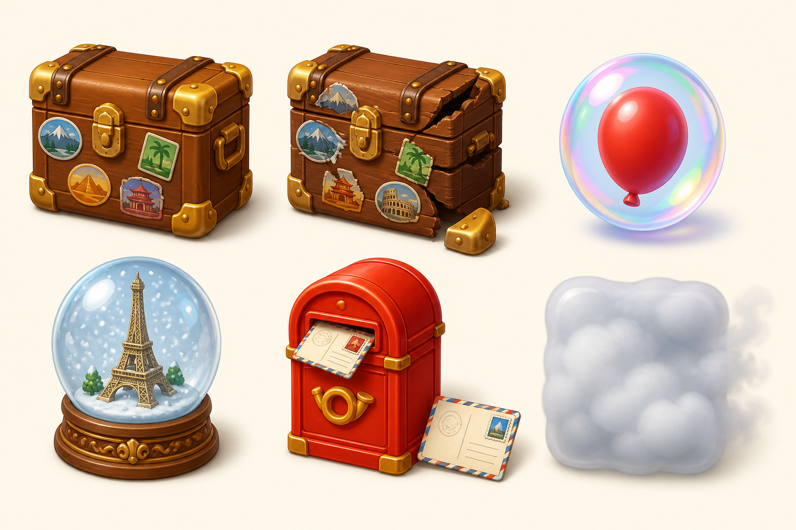
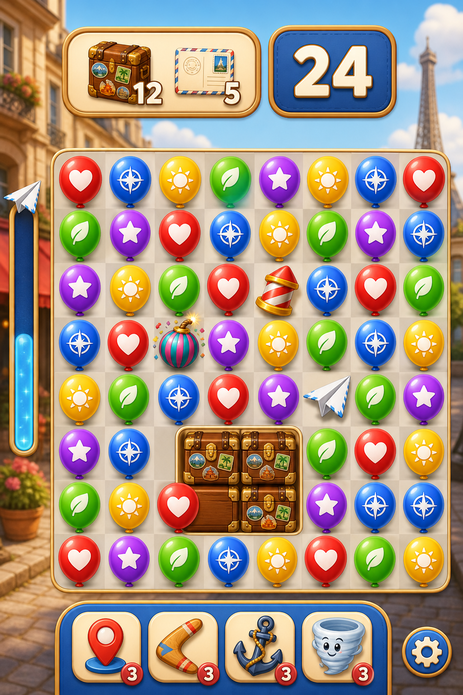
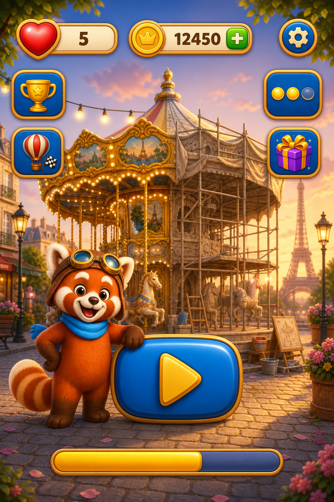
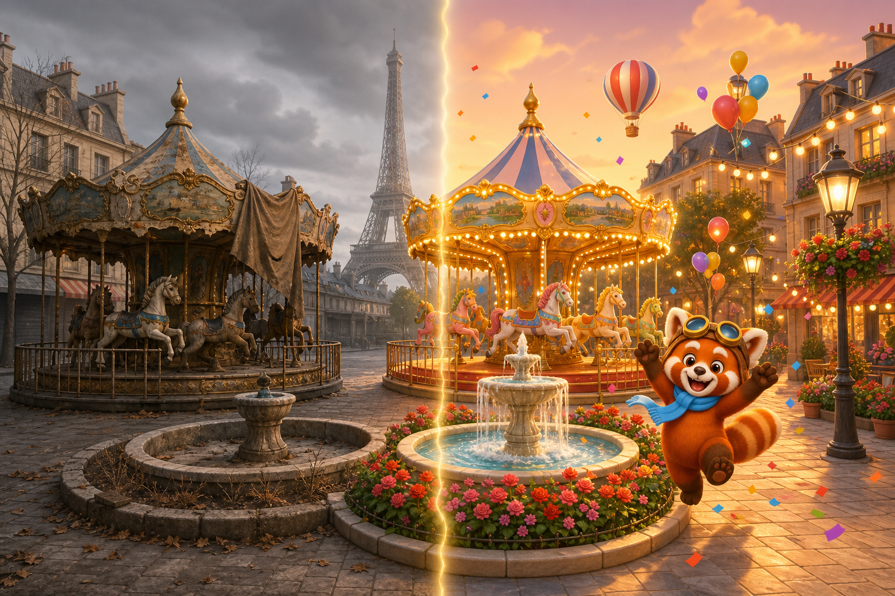
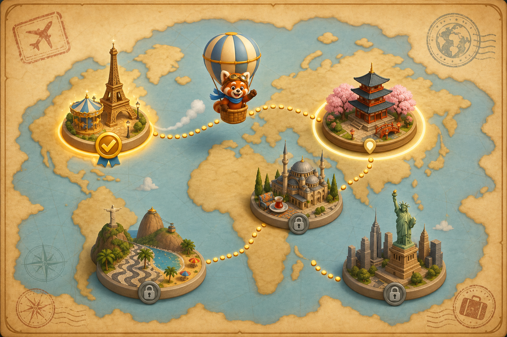

# BLAST VOYAGE — Visual Concept Pack

**Companion to `Blast_Voyage_Game_Design.md` (Case Study Part 2)**

Concept visuals for every game element and design layer described in the design document. Each visual is referenced back to the section of the design document it illustrates. Art direction across the pack: soft 3D-rendered premium-casual look, saturated colors, glossy rounded forms, silhouette-first readability — the register established by the Graphics sections of the case study.

---

## 1. Coco — the Mascot (Design doc §5.2)

Coco the red panda balloon pilot: aviator goggles, leather pilot cap, sky-blue scarf. Expressive, silent (no localization burden in the acting). Three brand poses: greeting, planning the route, celebrating a restoration.

---

## 2. Basic Match Elements — the Six Balloons (Design doc §4.1)

Glossy, "poppable" balloons with a visible knot and candy highlight. Six colors at maximum hue separation, **each carrying a unique white travel symbol for colorblind accessibility and instant group parsing**: red/heart-stamp, blue/compass-rose, yellow/sun, green/leaf, purple/star, orange/paper-plane. Identical size and silhouette — color and symbol are the only variables, by design.

---

## 3. Power-Ups (Design doc §2.3, §2.5, §4.2)

Left to right:

- **Firework** (5–6 group) — nose cone visibly pointing in its firing direction, because orientation is gameplay information and is worn on the art (novel rule 1: orientation derives from the popped group's shape, previewed pre-tap).
- **Confetti Bomb** (7–8 group) — striped party popper; radius-2 blast; screen shake reserved for Bomb-and-above.
- **Globe** (9+ group) — glassy, softly glowing, drawn like the prize it is; clears every balloon of its color.
- **Paper Plane** (spawned by the Breeze Meter, novel rule 2) — crisp origami; seeks the nearest goal; carries partner power-ups in combos.

---

## 4. Boosters — In-Level Tray Items (Design doc §4.3)

Left to right: **Pin** (pops one tile — the surgical tool), **Boomerang** (clears a row), **Anchor** (clears a column), **Whirlwind** (reshuffles all balloons; obstacles stay). None consume a move; zero-count slots show a coin price in place.

---

## 5. Obstacles — First-50 Roster (Design doc §4.4)

All obstacles obey the two universal rules: damaged only by adjacent blasts and power-up effects, and remaining state always drawn on the object (no hidden health).

- **Luggage Crate** — vintage trunk with destination stickers; shown in both damage states (intact → cracked with torn stickers) to illustrate the drawn health rule.
- **Bubble** — encases a balloon; one adjacent hit frees it *into* the color economy (generous by design).
- **Souvenir** — snow globe; rides gravity to the bottom collector row (lane-control puzzle).
- **Mailbox** — each hit ejects a stamped postcard collectible (spawner; forces repeated regional attention).
- **Fog** — spreads if none is cleared in a turn; the only obstacle that acts back, reserved for late-chapter drama.

---

## 6. Gameplay Screen — Full Concept (Design doc §2.1, §7.2)

The production-art rendering of the gameplay wireframe: goal panel and oversized moves counter on top; 9×9 balloon board with a Firework, Confetti Bomb, and Paper Plane in play and a crate cluster to excavate; the **Breeze Meter** on the left rail filling toward the next Paper Plane; the booster tray below. Background (Paris street) tonally muted so the board owns the eye.

---

## 7. Home Screen — Full Concept (Design doc §7.1)

The map-as-home thesis rendered: one giant Play action centered with Coco beside it; the restoring carousel *behind* the node so every visit to the home screen is a look at the progress monument; lives/coins in the top bar; event widgets rail-bound on the perimeter; chapter restoration progress at the bottom.

---

## 8. Meta Layer — Restoration Before/After (Design doc §5.1)

The emotional payoff of the meta loop in one image: the same Paris square neglected (left) and fully restored (right). Restorations happen automatically as levels are won — zero decoration decisions — and the chapter-finale transformation scene is synchronized with the flagged wall level, so the hardest fight and the biggest reward become one memory.

---

## 9. Meta Layer — World Tour Map (Design doc §5.1)

Chapter progression as geography: the golden route hops Paris → Tokyo → Istanbul → Rio → New York, with completed chapters glowing, the current destination pulsing, and locked chapters desaturated. Coco's balloon travels the route between chapters. The content roadmap is inexhaustible and globally inclusive by construction — there is always another city.

---

*Note on usage: these are AI-assisted concept visuals produced to communicate art direction and readability intent (per case study Note 2, concept ideas may be backed by reference imagery). Final production art would be authored by the art team to these specifications.*
